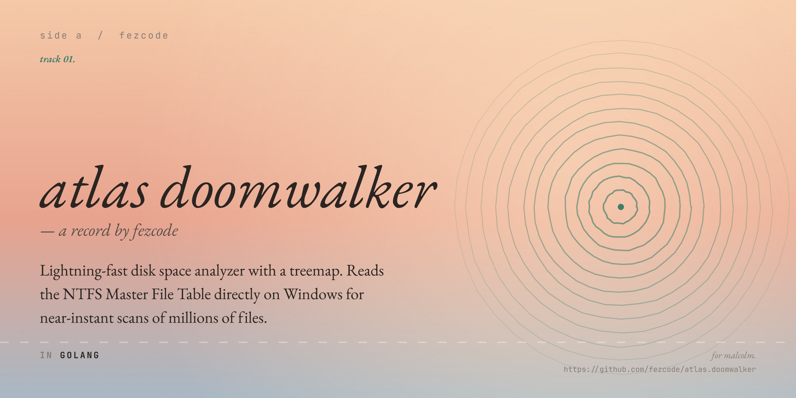

# atlas.doomwalker



A lightning-fast disk space analyzer with a treemap.
Reads the NTFS Master File Table directly on Windows for near-instant scans of
millions of files; falls back to a portable filesystem walker on Linux and
macOS. Ships both a polished TUI and a browser-based UI.

---

## Why

Walking a filesystem with the OS file APIs is slow because every directory
descent is a syscall. WizTree's trick on NTFS is to bypass the OS entirely and
read the **Master File Table** — a single contiguous structure that lists every
file and directory on the volume — straight off the disk. A 4 TB drive with a
million files scans in seconds rather than minutes.

`atlas.doomwalker` does the same on Windows. On platforms without an MFT
(Linux, macOS, FAT/exFAT volumes, network shares) it falls back to a
cross-platform walker so the rest of the tool — the treemap, the navigation,
the web UI — still works.

## Install

### Pre-built binaries

Grab the binary for your platform from the [releases page][rel] and put it on
your `PATH`. Six binaries are published per release: `windows-amd64`,
`windows-arm64`, `linux-amd64`, `linux-arm64`, `darwin-amd64`, `darwin-arm64`.

[rel]: https://github.com/fezcode/atlas.doomwalker/releases

### From source

```bash
git clone https://github.com/fezcode/atlas.doomwalker
cd atlas.doomwalker
go build -o atlas.doomwalker .
```

Or with [`gobake`](https://github.com/fezcode/gobake) to produce all six
platform binaries at once:

```bash
gobake build
```

## Usage

```text
atlas.doomwalker [flags] [drive|path]
```

### TUI

```powershell
.\atlas.doomwalker.exe                # scan C: with the MFT scanner (Windows)
.\atlas.doomwalker.exe D:             # scan D:
.\atlas.doomwalker.exe --walker C:    # skip MFT, use the portable walker
```

```bash
./atlas.doomwalker /home              # walk /home (Linux/macOS)
./atlas.doomwalker --walker ~/Downloads
```

### Browser UI

```bash
atlas.doomwalker --serve              # binds 127.0.0.1:7878 by default
atlas.doomwalker --serve --addr :8080 # bind a different address
```

The server prints a URL; open it. The page is a single-page app that lazily
fetches subtrees, so even a 50 GB folder with hundreds of thousands of entries
stays responsive.

### Flags

| Flag                | Meaning                                              |
|---------------------|------------------------------------------------------|
| `--serve`           | Run the browser UI instead of the TUI               |
| `--addr <host:port>`| Bind address for `--serve` (default `127.0.0.1:7878`) |
| `--walker`          | Force the cross-platform walker (skip MFT)           |
| `-v`, `--version`   | Print version                                        |
| `-h`, `--help`      | Print help                                           |

## Keyboard

### TUI

| Key             | Action                                              |
|-----------------|-----------------------------------------------------|
| `↑` / `k`       | Move selection up                                   |
| `↓` / `j`       | Move selection down                                 |
| `Home` / `g`    | First item                                          |
| `End` / `G`     | Last item                                           |
| `PgUp` / `PgDn` | Jump 10                                             |
| `Enter` / `→` / `l` | Drill into selected directory                   |
| `Backspace` / `←` / `h` | Go up                                       |
| `s`             | Cycle sort: size → name → item count                |
| `.`             | Toggle hidden / `$`-prefixed entries                |
| `o`             | Open selection in Explorer                          |
| `d`             | Delete selection (with confirmation)                |
| `q` / `Ctrl+C`  | Quit                                                |

### Browser UI

| Key            | Action                       |
|----------------|------------------------------|
| Click tile     | Drill into directory         |
| Click crumb    | Jump to that level           |
| `Esc` / `⌫`    | Up one level                 |
| `1`–`9`        | Open the Nth largest item    |

## Permissions

The MFT scanner reads the raw NTFS volume, which on Windows requires
**Administrator** privileges. If you launch without elevation, the program
re-launches itself elevated through UAC. Pass `--walker` if you want to skip
the elevation prompt and use the portable scanner instead.

The walker needs no special privileges and silently skips paths it can't read.

## How it works

```text
                              ┌────────────────────┐
                              │   main.go          │
                              │   (flag parsing,   │
                              │    UAC, dispatch)  │
                              └─────────┬──────────┘
                                        │
                          ┌─────────────┴─────────────┐
                          │                           │
                  Windows + admin               anything else
                          │                           │
                ┌─────────▼─────────┐       ┌─────────▼─────────┐
                │  internal/mft     │       │ internal/walker   │
                │  raw \\.\C:       │       │ filepath.WalkDir  │
                │  parses MFT       │       │ statx fallback    │
                │  records          │       │                   │
                └─────────┬─────────┘       └─────────┬─────────┘
                          │                           │
                          └─────────────┬─────────────┘
                                        │
                              *mft.FileNode tree
                                        │
                          ┌─────────────┴─────────────┐
                          │                           │
                ┌─────────▼─────────┐       ┌─────────▼─────────┐
                │  internal/ui      │       │  internal/web     │
                │  Bubble Tea TUI   │       │  http.Server +    │
                │  squarified       │       │  embedded SPA     │
                │  treemap          │       │  (SVG treemap)    │
                └───────────────────┘       └───────────────────┘
```

The squarified treemap algorithm
([Bruls, Huijsen & van Wijk, 2000](https://www.win.tue.nl/~vanwijk/stm.pdf))
is implemented in both Go (for the TUI) and JavaScript (for the browser UI),
so layouts are visually consistent across the two front-ends.

## Project layout

```text
atlas.doomwalker/
├── main.go                # entry, dispatch
├── main_windows.go        # UAC elevation
├── main_other.go          # POSIX stubs
├── Recipe.go              # gobake build tasks
├── internal/
│   ├── mft/               # NTFS MFT scanner (Windows)
│   ├── walker/            # cross-platform filepath.WalkDir scanner
│   ├── treemap/           # squarified algorithm (Go)
│   ├── ui/                # Bubble Tea TUI
│   └── web/               # HTTP server + embedded SPA
│       └── static/        # index.html, app.css, app.js
└── build/                 # output from `gobake build`
```

## Acknowledgements

- [`charmbracelet/bubbletea`](https://github.com/charmbracelet/bubbletea) and
  [`lipgloss`](https://github.com/charmbracelet/lipgloss) for the TUI.
- [`t9t/gomft`](https://github.com/t9t/gomft) for the Go MFT record parser.
- [WizTree](https://wiztree.en.lo4d.com/) for proving how fast a disk analyzer
  can be.
- The squarified treemap paper by Mark Bruls, Kees Huijsen and Jarke J. van Wijk.

## License

MIT — see [LICENSE](LICENSE).
